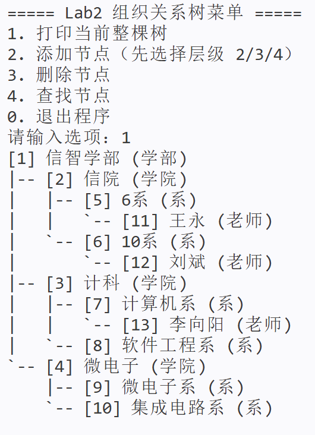
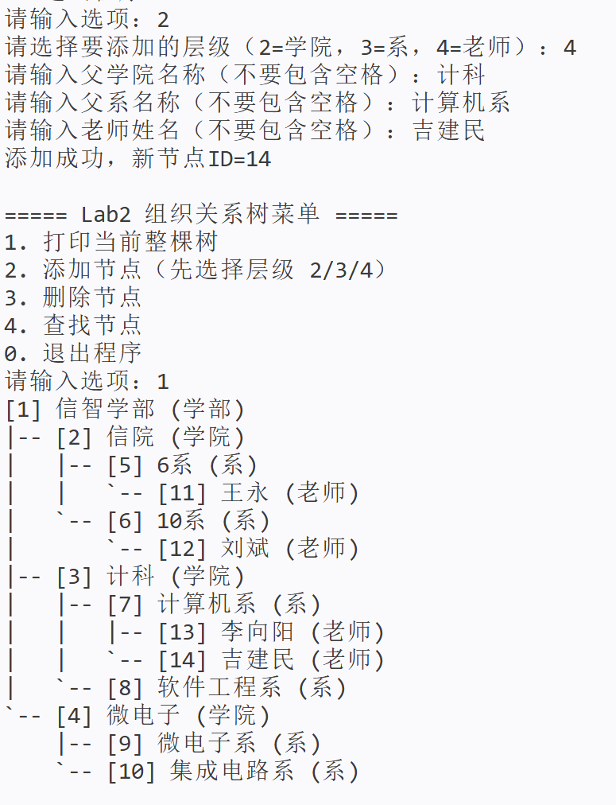
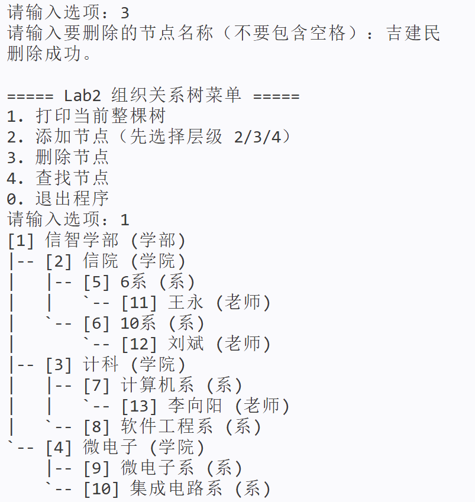
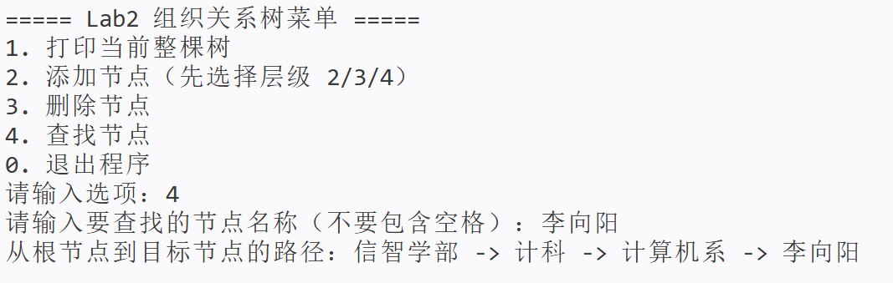

# Lab2: 组织结构关系树

## 一、实验目标

本实验使用树结构表示组织关系：`学部 -> 学院 -> 系 -> 老师`。

**省流：完成RelationTree.cpp里的TODO然后参考 五、编译与运行 进行编译运行**


## 二、当前代码约定

### 1) 名称约定（已在 `main.cpp` 初始化）

- 根节点：`信智学部`
- 学院：`信院`、`计科`、`微电子`
- 系：`6系`、`10系`、`计算机系`、`软件工程系`、`微电子系`、`集成电路系`
- 预置老师：`王永`、`刘斌`、`李向阳`

### 2) 操作约定

- 添加节点：按“父节点名称 + 新节点名称”添加
- 删除节点：按“节点名称”删除
- 路径输出：按“叶子节点名称”输出从根到叶子的路径
- 设定：默认不重名（实现时可按“找到即用”处理）

## 三、需要完成的 3 个函数

文件：`RelationTree.cpp`，直接在TODO后面进行补充即可

### 1) `AddNode`


要求：
1. 做参数合法性检查。
2. 在树中找到父节点名称对应的节点。
3. 判断父节点孩子数是否达到 `MAX_SIZE`。
4. 创建新节点并挂接到父节点。
5. 成功返回新节点 ID，失败返回 `-1`。

### 2) `DeleteNode`

要求：
1. 做参数合法性检查。
2. 在树中找到目标节点（按名称）。
3. 禁止删除根节点。
4. 删除目标节点及其子树。
5. 删除后维护父节点 `children` 数组连续。
6. 成功返回 `1`，失败返回 `0`。

### 3) `PrintPathToLeaf`

要求：
1. 做参数合法性检查。
2. 找到目标节点（按名称）。
3. 仅当目标是叶子节点时继续。
4. 回溯父指针得到路径并按 `根 -> ... -> 叶子` 输出。
5. 成功返回 `1`，失败返回 `0`。

## 四、已给出的函数

`RelationTree.cpp` 中已提供：

- `Init`
- `Destroy`
- `GetRootId`
- `PrintTree`
- 以及内部辅助函数：`CreateNode`、`FreeSubtree`、`PrintDfs`

## 五、编译与运行

在 `Lab2` 目录执行：（如果在上一层DSAProject文件夹的话cd Lab2即可）

```bash
g++ -std=c++11 -Wall -Wextra -finput-charset=UTF-8 -fexec-charset=GBK -o main.exe main.cpp RelationTree.cpp TreeNode.cpp

./main.exe
```

## 六、实验预期效果


1. 打印树（已实现，不需要完成）


2. 添加节点


3. 删除节点


4. 查找节点（输出根到目标节点路径）

