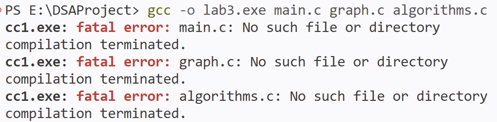
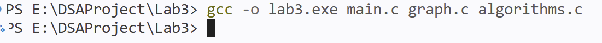
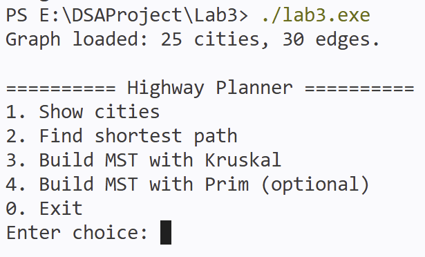
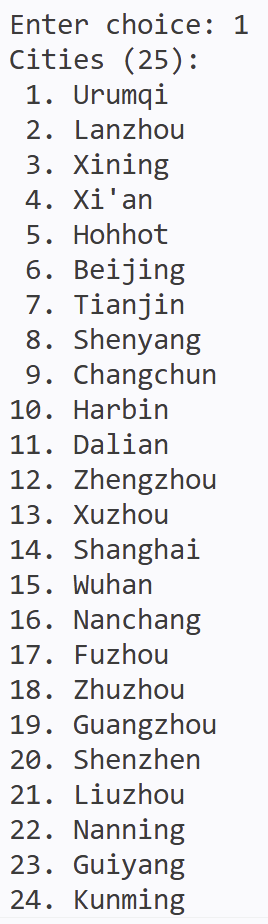
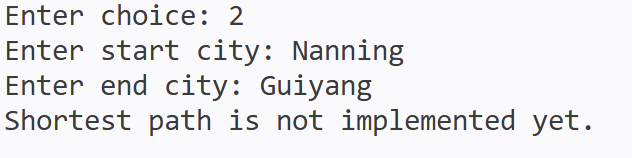
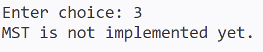
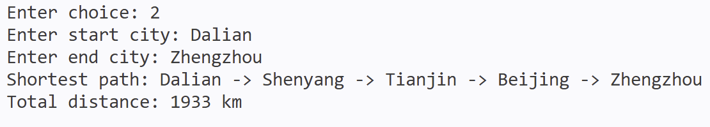
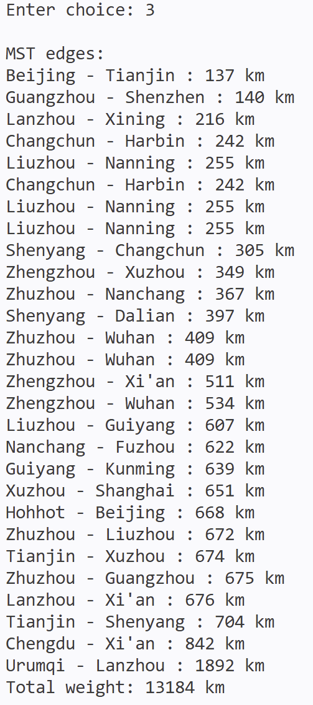
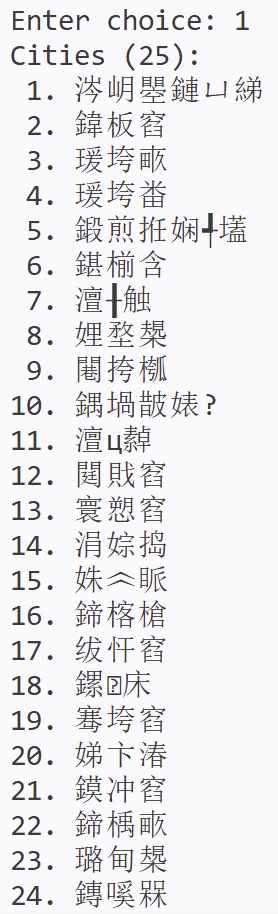

# Lab3: 城市高速公路规划

声明：如果你的实验遇到了一些错误，先到本文件“编程建议及实验效果”部分查看能否解决你的问题

## 实验目标

已知中国主要城市之间的路线及距离如图[distances.jpg](distances.jpg)，完成两个任务：

1. 在保证所有城市都连通的前提下，使总里程最少，构建最小生成树（MST）。
2. 假设图中所有路线都已开通，实现任意两个城市之间的最短路径规划。

## 实验要求

本实验框架已经提供：

- 主程序菜单框架
- 菜单交互框架
- 算法函数接口

学生需要完成的核心内容包括：

1. [graph.h](graph.h) 中图的底层存储设计：二选一并在 `Graph` 中定义（邻接矩阵：`adj_matrix[i][j]`；邻接表：`head[i]` + 结点{to, weight, next}）
2. [graph.c](graph.c) 中图初始化、加边、双文件读图建图：补全 `graph_init` / `graph_add_edge`（邻接矩阵：对角 0，其余 `INF_DISTANCE` + 无向边双向赋值；邻接表：head 置空 + 每条边插入两次）
3. [algorithms.c](algorithms.c) 中 `kruskal_mst`
4. [algorithms.c](algorithms.c) 中 `dijkstra_shortest_path`
5. [algorithms.c](algorithms.c) 中 `prim_mst`（不作要求，可选做）

## 代码结构

- `cities.txt`：英文城市编号表，格式为 `编号 城市名`
- `cities_zh.txt`：中文城市编号表，格式与 `cities.txt` 相同
- `edges.txt`：边数据，格式为 `起点编号 终点编号 距离`
- `graph.h` / `graph.c`：图结构与建图 TODO，学生自行选择邻接矩阵或邻接表
- `algorithms.h` / `algorithms.c`：核心算法框架与 TODO
- `main.c`：菜单交互与结果输出

## 编译与运行

在终端中进入 `Lab3` 目录后执行：(注意，执行这条命令需要你的电脑上已配置好了gcc，详情见[vscode.md](../vscode.md))里面前三步

```bash
gcc -o lab3.exe main.c graph.c algorithms.c
./lab3.exe
```

## 功能说明

程序启动后会自动读取 `cities.txt` 和 `edges.txt`，并提供以下功能：

1. 显示城市列表
2. 调用最短路径接口
3. 调用 `Kruskal` 最小生成树接口
4. 调用 `Prim` 最小生成树接口（选做展示）

如果想使用中文城市名，可以将 `main.c` 中的 `cities.txt` 改为 `cities_zh.txt`。

在学生完成 `graph` 和 `algorithms` 中的 `TODO` 之前，程序会提示相应模块尚未完成。

## 编程建议及实验效果

- 建议先确定图存储方式，再完成建图函数
- 建图时先处理城市编号与名称映射，再处理边文件
- 完成建图后先实现 `Kruskal`，验证最小生成树边数是否为 `city_count - 1`
- 再实现 `Dijkstra`，重点检查路径恢复是否正确

如果你在运行`gcc -o lab3.exe main.c graph.c algorithms.c`的时候遇到了这种问题：



说明你执行命令的目录错了（例如这里是在Lab3的上一层），那么在终端输入`cd Lab3`即可



编译命令不会有任何信息显示，上述结果是正常结果，然后就得到了lab3.exe,你可以选择直接点开lab3.exe，或者在终端输入`./lab3.exe`来运行,会得到这个结果：





如果一开始输入2或3显示如下图所示，是正常情况：





将TODO补齐就可以看到这样效果：





如果你觉得城市名用中文看更方便一些且你没有中文编码问题，那么在`main.c`中142行找到这行代码：` if (!graph_load_from_files(&graph, "cities.txt", "edges.txt"))`,将`cities.txt`改成`cities_zh.txt`

当然我的电脑是有编码问题的，效果如下：



所以慎重修改
