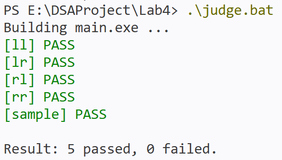

# Lab4: AVL 平衡二叉树实验框架

## 实验目标

从键盘输入任意一组整数，构建 AVL 平衡二叉排序树，并输出构建结果。

## 实验要求

本实验框架已经提供：

- 主程序输入输出框架
- AVL 结点结构定义
- 遍历输出函数
- 销毁函数
- 旋转与插入函数接口

你需要完成的核心内容包括：

1. `rotate_left`
2. `rotate_right`
3. `avl_insert`

## 功能说明

程序运行后：

1. 从键盘读入一行整数，整数之间用空格分隔
2. 依次将这些整数插入 AVL 树
3. 自动进行 LL / RR / LR / RL 调整，保持平衡
4. 输出最终 AVL 树的侧向结构
5. 输出前序、中序、后序遍历结果

说明：

- 重复元素会自动忽略
- 当前最多支持输入 `256` 个整数
- 在补全 `TODO` 之前，程序会提示核心功能尚未完成

## 代码结构

- `main.c`：键盘输入、数据解析、结果输出
- `avl.h`：AVL 结点结构与函数声明
- `avl.c`：AVL 相关函数框架与 `TODO`

## 编译与运行

在终端进入 `Lab4` 目录后执行：

下面是编译命令，如果你修改了代码需要重新生成可执行文件（exe），那么输入这一条进行编译：
```bash
gcc -o main.exe main.c avl.c
```

下面是执行可执行文件命令（可等效为直接双击打开main.exe），如果你没有修改代码，只是想重新运行的话，只需要输入下面这条指令：
```
./main.exe
```

## 编程建议

- 先完成单旋：左旋、右旋
- 再完成 AVL 插入中的高度更新与平衡因子计算
- 最后处理 LL / RR / LR / RL 四种失衡情况
- 建议先用少量数据测试，例如 `3 2 1`、`1 2 3`、`3 1 2`、`1 3 2`

## 运行说明

如果还没有补完 `avl.c` 中的 `TODO`，运行程序时会看到提示：

```text
AVL insert is not implemented yet.
Please complete the TODOs in avl.c and try again.
```

## 测试样例

`tests` 目录中提供了一组输入输出样例：

- `sample`：普通综合样例
- `ll`：LL 旋转
- `rr`：RR 旋转
- `lr`：LR 旋转
- `rl`：RL 旋转
- `duplicate`：重复元素
- `invalid`：非法输入

可以使用测试程序来进行测试（可能不稳定,如果遇到问题请忽略这条）：
```powershell
.\judge.bat
```
或
```
powershell -ExecutionPolicy Bypass -File .\judge.ps1
```

如果成功你会看到：


如果对单个文件进行测试，在 Windows 中测试时：

如果你使用的是 `PowerShell`（如vscode终端），可以执行：

```powershell
cmd /c "main.exe < tests\sample_input.txt"
```

如果你使用的是 `cmd`，可以执行：

```bash
main.exe < tests\sample_input.txt
```

将程序输出与 `tests/sample_output.txt` 对比即可。
