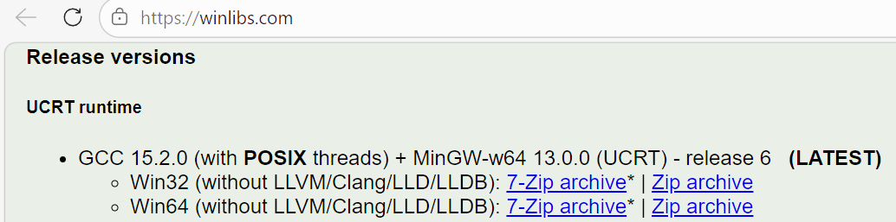
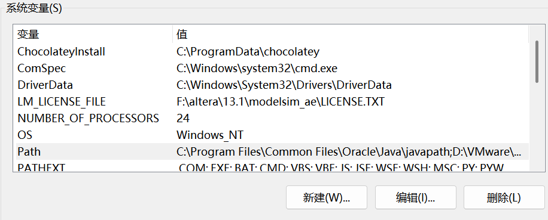
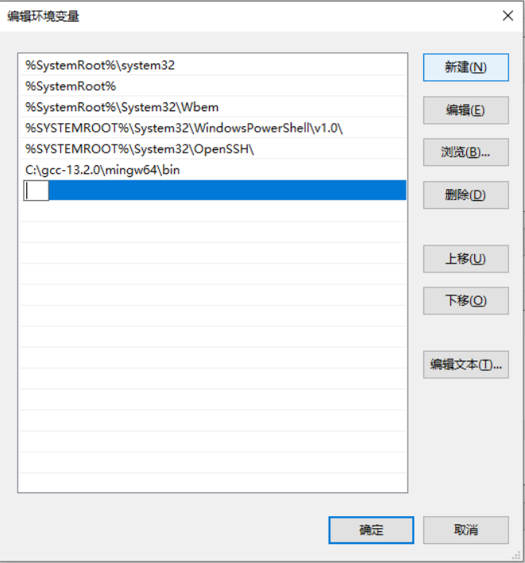
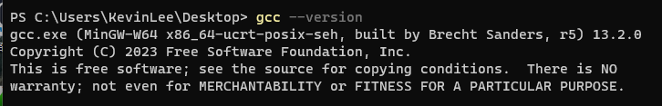
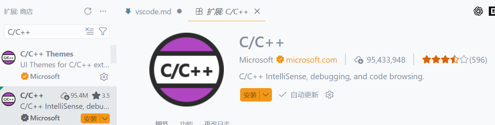
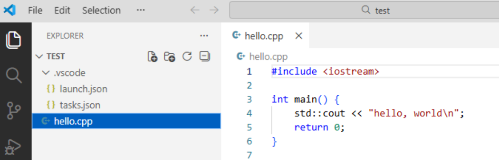
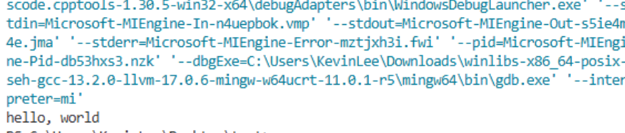

# 简介
Visual Studio Code（VS Code）是一款轻量且可扩展的代码编辑器，支持多种编程语言与平台，插件生态丰富。本文档给出 Windows 下配置 C/C++ 开发环境的常用步骤与示例截图。

# 安装与参考
- 官网下载：https://code.visualstudio.com/
- 官方文档：https://code.visualstudio.com/docs
- C/C++ 配置参考（示例）：https://blog.iw17.net/vscode-c-cpp/

## 配置步骤（Windows + MinGW-w64）

提示：建议先执行“第三步（验证安装）”，如果 `gcc --version` 已能显示版本信息，可直接跳到“第四步”。

### 第一步：下载并解压 MinGW-w64
1. 访问 https://winlibs.com/
2. 在页面中找到 GCC 最新版（对应 Windows 64 位）并下载 ZIP。
3. 解压到你希望放置编译器的位置，例如 `C:\mingw64`。



### 第二步：把 MinGW 加入系统 PATH
1. 复制 MinGW 安装目录路径，例如 `C:\mingw64`。
2. 打开“编辑系统环境变量”（可在开始菜单搜索，或 Win+R 输入 `SystemPropertiesAdvanced`）。
3. 点击“环境变量”，找到 `Path` 并编辑。
4. 新增 `C:\mingw64\bin`，保存并关闭。

流程示意：






### 第三步：验证安装
在 CMD 或 PowerShell 中执行：

```powershell
gcc --version
```

未安装成功时，可能提示找不到命令：


安装成功时，会显示版本信息：


### 第四步：在 VS Code 安装 C/C++ 插件
1. 打开 VS Code，点击左侧扩展（Extensions）图标。

2. 搜索并安装 `C/C++`（Microsoft 发布）。


### 第五步：配置 C/C++ 任务与调试
项目结构示例：

```text
project-folder/
  .vscode/
    launch.json
    tasks.json
  hello.cpp
```

`launch.json` 示例：

```json
{
  "configurations": [
    {
      "name": "(gdb) Launch",
      "type": "cppdbg",
      "request": "launch",
      "program": "${fileDirname}\\${fileBasenameNoExtension}.exe",
      "args": [],
      "stopAtEntry": false,
      "cwd": "${fileDirname}",
      "environment": [],
      "externalConsole": false,
      "MIMode": "gdb",
      "miDebuggerPath": "gdb",
      "setupCommands": [
        {
          "description": "Enable pretty-printing for gdb",
          "text": "-enable-pretty-printing",
          "ignoreFailures": true
        },
        {
          "description": "Set Disassembly Flavor to Intel",
          "text": "-gdb-set disassembly-flavor intel",
          "ignoreFailures": true
        }
      ],
      "preLaunchTask": "C/C++: gcc build active file"
    }
  ]
}
```

`tasks.json` 示例：

```json
{
  "tasks": [
    {
      "type": "cppbuild",
      "label": "C/C++: gcc build active file",
      "command": "g++",
      "args": [
        "-fdiagnostics-color=always",
        "-Wall",
        "-Wextra",
        "-Wpedantic",
        "-Wshadow",
        "-g",
        "${file}",
        "-o",
        "${fileDirname}\\${fileBasenameNoExtension}.exe"
      ],
      "options": {
        "cwd": "${fileDirname}"
      },
      "problemMatcher": [
        "$gcc"
      ],
      "group": {
        "kind": "build",
        "isDefault": true
      },
      "detail": "Task generated by Debugger."
    }
  ],
  "version": "2.0.0"
}
```

测试程序：

```cpp
#include <iostream>

int main() {
    std::cout << "hello, world\\n";
    return 0;
}
```

运行示意：

点击三角运行按钮：
运行结果：


如果系统终端里 `gcc --version` 正常，但 VS Code 终端不正常，通常重启 VS Code 即可。
